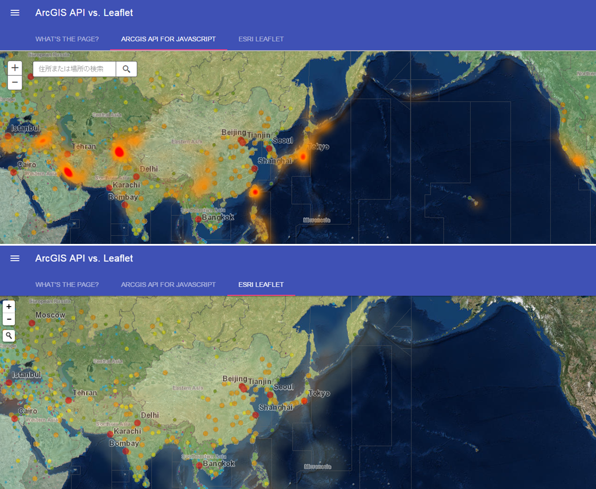

# ArcGIS API? or Leaflet?

[http://ynunokawa.github.io/arcgisapi-vs-leaflet/index.html](http://ynunokawa.github.io/arcgisapi-vs-leaflet/index.html)

ArcGIS プラットフォームを利用して Web アプリを開発する際に、JavaScript ライブラリの選択肢は大きく2つに分かれます。

## ArcGIS API for JavaScript

ArcGIS が提供する Web API です。ArcGIS に最適化されたライブラリであるため、ArcGIS のリソースをフルに活用することができます。ArcGIS プラットフォームを使って開発を行う際の一番の選択肢となります。

* [ArcGIS API for JavaScript](https://developers.arcgis.com/javascript/)

## Leaflet

Leaflet はオープンソースの地図アプリ開発用ライブラリです。機能はミニマムで非常に軽量な設計となっており、モバイル Web にも適しています。Leaflet は機能拡張を行う際は、プラグインを適用するエコシステムを採用しており、ArcGIS リソースを利用するための Esri Leaflet プラグインがオープンソースとして公開されているため、Leaflet ベースの ArcGIS Web アプリの開発が可能です。

* [Leaflet](http://leafletjs.com/)

### Esri Leaflet

Leaflet アプリで ArcGIS リソースを利用するためのプラグインです。

* [Esri Leaflet](http://esri.github.io/esri-leaflet/)

## リソース

* [ArcGIS API for JavaScript](https://developers.arcgis.com/javascript/)
* [Leaflet](http://leafletjs.com/)
* [Esri Leaflet](http://esri.github.io/esri-leaflet/)
* [jQuery](https://jquery.com/)
* [Material Design Lite](http://www.getmdl.io/)

## ライセンス
Copyright 2015 Esri Japan Corporation.

Licensed under the Apache License, Version 2.0 (the "License");
you may not use this file except in compliance with the License.
You may obtain a copy of the License at

   http://www.apache.org/licenses/LICENSE-2.0

Unless required by applicable law or agreed to in writing, software
distributed under the License is distributed on an "AS IS" BASIS,
WITHOUT WARRANTIES OR CONDITIONS OF ANY KIND, either express or implied.
See the License for the specific language governing permissions and
limitations under the License.

A copy of the license is available in the repository's [license.txt](/license.txt) file.
